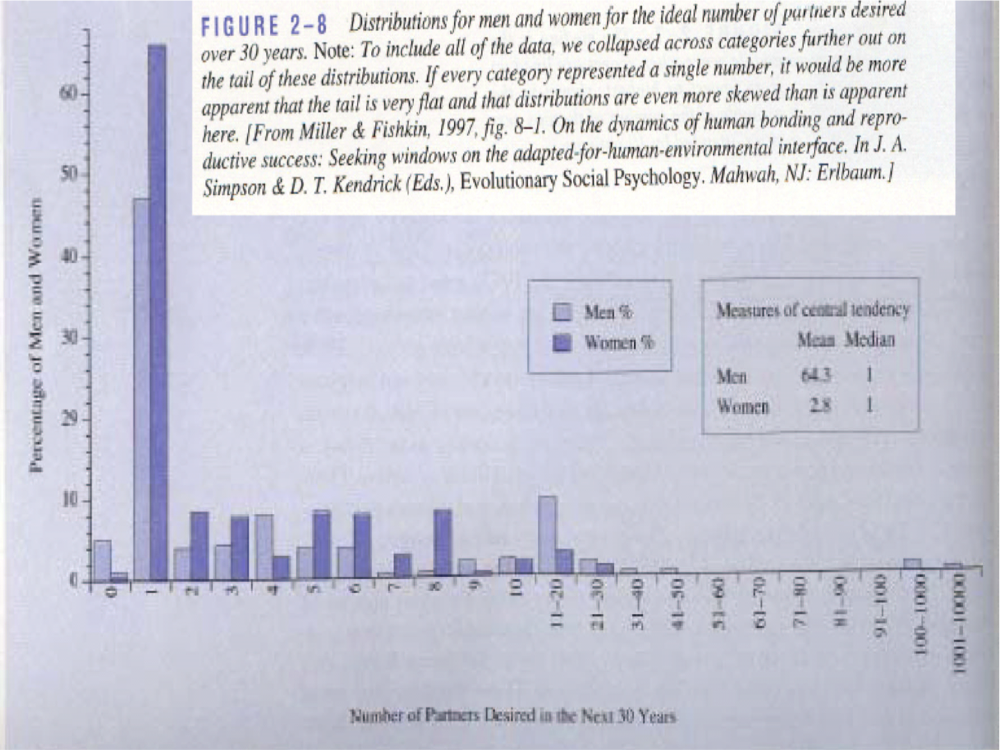

# Outline {-}

1. Introduction

2. Preprocessing

    - Log-transformation
    - Filtering
    - Normalization
    - Summarization
    
# Intro: Challenges in Label-Free Quantitative Proteomics

## MS-based workflow
```{r echo=FALSE}
knitr::include_graphics("./figures/ProteomicsWorkflow.png")
```
  
- Peptide Characteristics
  
  - Modifications
  - Ionisation Efficiency: huge variability
  - Identification
    - Misidentification $\rightarrow$ outliers
    - MS$^2$ selection on peptide abundance
    - Context depending missingness
    - Non-random missingness

$\rightarrow$ Unbalanced pepide identifications across samples and messy data

## Level of quantification

- MS-based proteomics returns peptides: pieces of proteins

```{r echo=FALSE}
knitr::include_graphics("./figures/challenges_peptides.png")
```

- Quantification commonly required on the protein level

```{r echo=FALSE}
knitr::include_graphics("./figures/challenges_proteins.png")
```

## Label-free Quantitative Proteomics Data Analysis Workflows

```{r echo=FALSE}
knitr::include_graphics("./figures/proteomicsDataAnalysis.png")
```

## CPTAC Spike-in Study


```{r echo=FALSE, out.width="60%"}
knitr::include_graphics("./figures/cptacLayoutLudger.png")
```

- Same trypsin-digested yeast proteome background in each sample
- Trypsin-digested Sigma UPS1 standard: 48 different human proteins spiked in at 5 different concentrations (treatment A-E) 
- Samples repeatedly run on different instruments in different labs
- After MaxQuant search with match between runs option

  - 41\% of all proteins are quantified in all samples
  - 6.6\% of all peptides are quantified in all samples

$\rightarrow$ vast amount of missingness


# Preprocessing

## Log-transformation

### Read data 


```{r, warning=FALSE, message=FALSE}
library(tidyverse)
library(limma)
library(QFeatures)
library(msqrob2)
library(plotly)
library(ggplot2)

peptidesFile <- "https://raw.githubusercontent.com/statOmics/PDA20/data/quantification/cptac/peptides.txt"

ecols <- grep("Intensity\\.", names(read.delim(peptidesFile)))

pe <- readQFeatures(
  table = peptidesFile,
  fnames = 1,
  ecol = ecols,
  name = "peptideRaw", sep="\t")

colData(pe)$lab <- rep(rep(paste0("lab",1:3),each=3),5) %>% as.factor
colData(pe)$condition <- pe[["peptideRaw"]] %>% colnames %>% substr(12,12) %>% as.factor
colData(pe)$spikeConcentration <- rep(c(A = 0.25, B = 0.74, C = 2.22, D = 6.67, E = 20),each = 9)
```


### Explore the data with plots

peptide AALEELVK from spiked-in UPS protein P12081. 
We only show data from lab1.

```{r}
subset <- pe["AALEELVK",colData(pe)$lab=="lab1"]
data.frame(concentration = colData(subset)$spikeConcentration,
           y = assay(subset[["peptideRaw"]]) %>% c
           ) %>% 
  ggplot(aes(concentration, y)) +
  geom_point() +
  xlab("concentration (fmol/l)")
```


- Variance increases with the mean
$\rightarrow$ Multiplicative error structure 

```{r}
data.frame(concentration = colData(subset)$spikeConcentration,
           y = assay(subset[["peptideRaw"]]) %>% c
           ) %>% 
  ggplot(aes(concentration, y)) +
  geom_point() + 
  scale_x_continuous(trans='log2') + 
  scale_y_continuous(trans='log2') +
  xlab("concentration (fmol/l)") +
  ggtitle("axes on log scale")
```

- Data seems to be homoscedastic on log-scale $\rightarrow$ log transformation of the intensity data

### log-transformation of the data 

- We calculate how many non zero intensities we have for each peptide and this can be useful for filtering.

```{r}
rowData(pe[["peptideRaw"]])$nNonZero <- rowSums(assay(pe[["peptideRaw"]]) > 0)
```


- Peptides with zero intensities are missing peptides and should be represent
with a `NA` value rather than `0`.

```{r}
pe <- zeroIsNA(pe, "peptideRaw") # convert 0 to NA
```

- Logtransform data 

```{r}
pe <- logTransform(pe, base = 2, i = "peptideRaw", name = "peptideLog")
```


## Filtering


- Reverse sequences
- Only identified by modification site (only modified peptides detected)
- Razor peptides: non-unique peptides assigned to the protein group with the most other peptides 
- Contaminants
- Peptides few identifications
- Proteins that are only identified with one or a few peptides

Filtering does not induce bias if the criterion is independent from the downstream data analysis!


### Handling overlapping protein groups

In our approach a peptide can map to multiple proteins, as long as there is
none of these proteins present in a smaller subgroup.

```{r}
pe[["peptideLog"]] <-
 pe[["peptideLog"]][rowData(pe[["peptideLog"]])$Proteins
 %in% smallestUniqueGroups(rowData(pe[["peptideLog"]])$Proteins),]
```

### Remove reverse sequences (decoys) and contaminants

We now remove the contaminants, peptides that map to decoy sequences, and proteins
which were only identified by peptides with modifications.

```{r}
pe[["peptideLog"]] <- pe[["peptideLog"]][rowData(pe[["peptideLog"]])$Reverse != "+", ]
pe[["peptideLog"]] <- pe[["peptideLog"]][rowData(pe[["peptideLog"]])$
    Potential.contaminant != "+", ]
```

### Remove peptides of proteins that were only identified with modified peptides

We skip this step a large protein groups file needed for this.

### Drop peptides that were only identified in one sample

We keep peptides that were observed at last twice.

```{r}
pe[["peptideLog"]] <- pe[["peptideLog"]][rowData(pe[["peptideLog"]])$nNonZero >= 2, ]
nrow(pe[["peptideLog"]])
```

We keep `r nrow(pe[["peptideLog"]])` peptides after filtering.

## Normalization 

```{r}
subset <- pe[,colData(pe)$condition=="D"] 

limma::plotDensities(
  assay(subset[["peptideLog"]]), 
  col = subset %>% colData %>% as.data.frame %>% pull("lab") %>% as.double,
  legend = FALSE,
  main = "condition D")

legend("topright", 
       legend = subset %>% colData %>% as.data.frame %>% pull("lab") %>% levels,
       col = subset %>% colData %>% as.data.frame %>% pull("lab") %>% nlevels %>% seq,
       lty=1)
```


```{r}
subset <- pe[,colData(pe)$lab=="lab2"] 

limma::plotDensities(
  assay(subset[["peptideLog"]]), 
  col = subset %>% colData %>% as.data.frame %>% pull("condition") %>% as.double,
  legend = FALSE,
  main = "lab 2")

legend("topright", 
       legend = subset %>% colData %>% as.data.frame %>% pull("condition") %>% levels,
       col = subset %>% colData %>% as.data.frame %>% pull("condition") %>% nlevels %>% seq,
       lty=1)
```


- Even in very clean synthetic dataset (same background, only 48 UPS
proteins can be different) the marginal peptide intensity distribution
across samples can be quite distinct

- Considerable effects between and within labs for replicate samples
- Considerable effects between samples with different spike-in
concentration

$\rightarrow$ Normalization is needed

### Mean or median?

<details><summary> </summary><p>
- Miller and Fishkin (1997) reported that over a period of 30 years males would like to have on average 64.3 partners and females 2.8. 
</p></details>


<details><summary> </summary><p>
- Miller and Fishkin (1997) reported that the median number of partners someone would like to have over a period of 30 years males is 1 for both males and females. 
</p></details>

<details><summary> </summary><p>
Mean is very sensitive to outliers!

```{r echo=FALSE}

```
</p></details>

### Normalization of the data by median centering

```{r}
pe <- normalize(pe, 
                i = "peptideLog", 
                name = "peptideNorm", 
                method = "center.median")
```

### Plots of normalized data

```{r}
subset <- pe[,colData(pe)$condition=="D"] 

limma::plotDensities(
  assay(subset[["peptideNorm"]]), 
  col = subset %>% colData %>% as.data.frame %>% pull("lab") %>% as.double,
  legend = FALSE,
  main = "condition D")

legend("topright", 
       legend = subset %>% colData %>% as.data.frame %>% pull("lab") %>% levels,
       col = subset %>% colData %>% as.data.frame %>% pull("lab") %>% nlevels %>% seq,
       lty=1)
```


```{r}
subset <- pe[,colData(pe)$lab=="lab2"] 

limma::plotDensities(
  assay(subset[["peptideNorm"]]), 
  col = subset %>% colData %>% as.data.frame %>% pull("condition") %>% as.double,
  legend = FALSE,
  main = "lab 2")

legend("topright", 
       legend = subset %>% colData %>% as.data.frame %>% pull("condition") %>% levels,
       col = subset %>% colData %>% as.data.frame %>% pull("condition") %>% nlevels %>% seq,
       lty=1)
```


- Upon normalization the marginal distributions of the peptide intensities across samples are much more comparable
- We still see deviations
- This can be due to technical variability and due 

### Summarization 

- We illustrate the summarisation issues using a subset of the cptac study (Lab 2, condition A and E) for a spiked protein (UPS P12081).

```{r}
subset <- pe[,colData(pe)$lab=="lab2"&colData(pe)$condition %in% c("A","E")] 
proteinIntensities <- assay(subset[["peptideNorm"]])[rowData(subset[["peptideNorm"]])$Proteins == "P12081ups|SYHC_HUMAN_UPS",]

matplot(proteinIntensities, 
        type = "b",
        pch = subset %>% colData %>% as.data.frame %>% pull("condition") %>% as.character,
        ylab = "log2 Intensity",
        xlab = "Peptide Sequence",
        main = "CPTAC (Lab2, P12081ups|SYHC_HUMAN_UPS)\n Median Summarization") 
abline(h=colMedians(proteinIntensities, na.rm=TRUE),
       col=1:6)
```

- We observe intensities from multiple peptides for each protein in a sample
- Pseudo-replication: peptide intensities from a particular protein in the same sample are correlated, i.e. they more alike than peptide intensities from a particular protein between samples. 
- Summarize all peptide intensities from the same protein in a sample into a single protein expression value
- Commonly used methods are mean summarization, median summarization and model based summarization

1. We will evaluate different summarization methods in the tutorial session
2. Can you anticipate on potential problems related to summarization?